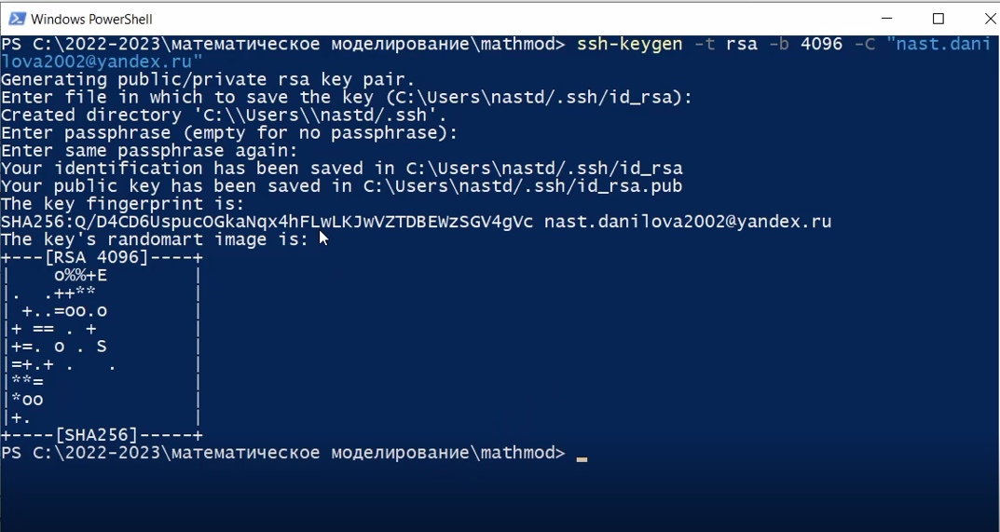
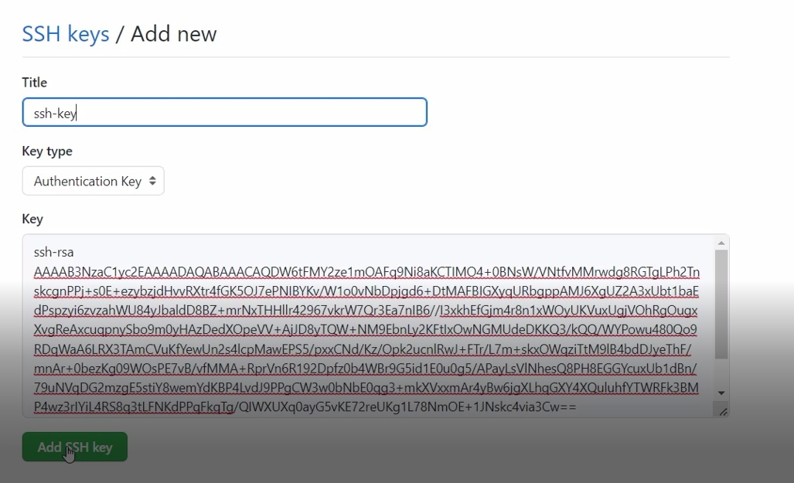
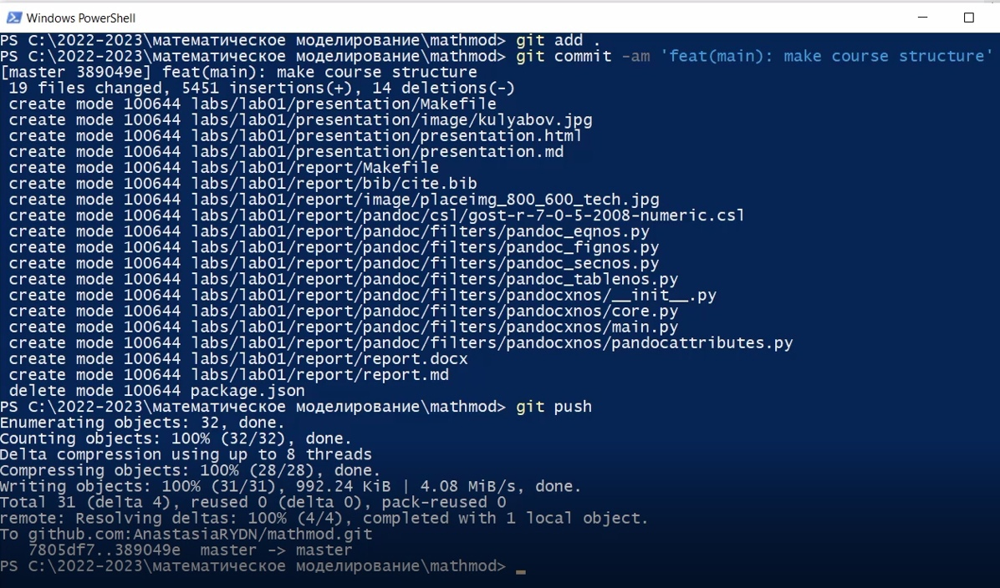

---
## Front matter
lang: ru-RU
title: Математическое моделирование
subtitle: Лабораторная работа №1
author:
  - Данилова А.С.
institute:
  - Российский университет дружбы народов, Москва, Россия
  - Объединённый институт ядерных исследований, Дубна, Россия
date: 11 февраля 2023

## i18n babel
babel-lang: russian
babel-otherlangs: english

## Formatting pdf
toc: false
toc-title: Содержание
slide_level: 2
aspectratio: 169
section-titles: true
theme: metropolis
header-includes:
 - \metroset{progressbar=frametitle,sectionpage=progressbar,numbering=fraction}
 - '\makeatletter'
 - '\beamer@ignorenonframefalse'
 - '\makeatother'
---

# Информация

## Докладчик

:::::::::::::: {.columns align=center}
::: {.column width="70%"}

  * Данилова Анастасия Сергеевна
  * С/б 1032201744
  * Российский университет дружбы народов
  * Нпибд-01-20

:::
::: {.column width="30%"}

:::
::::::::::::::

::: incremental

## Цели и задачи

-	Создать рабочую область
- Создать репозиторий на GitHub
-	Создать отчет с помощью Markdown

:::

::: incremental

## Материалы и методы

- Дополнительные источники
- Документация Github

:::

## Создание рабочей области

::: incremental

Устанавливаем необходимые пакеты, используем PowerShell, а также GitHub

:::

##
::: incremental

Сгенерировать ключ и использовать для переноса файлов

:::
##

::: incremental

:::

##
::: incremental

Переносим измененные файлы обратно на git

:::

## Результаты

::: incremental

Мы вспомнили язык разметки Markdowm, научились правильно создавать рабочую область и потренировались работать с GitHub

:::

