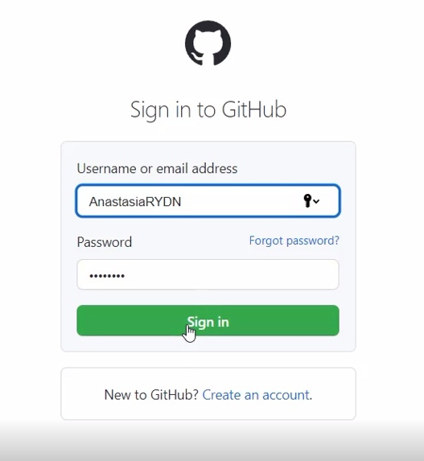
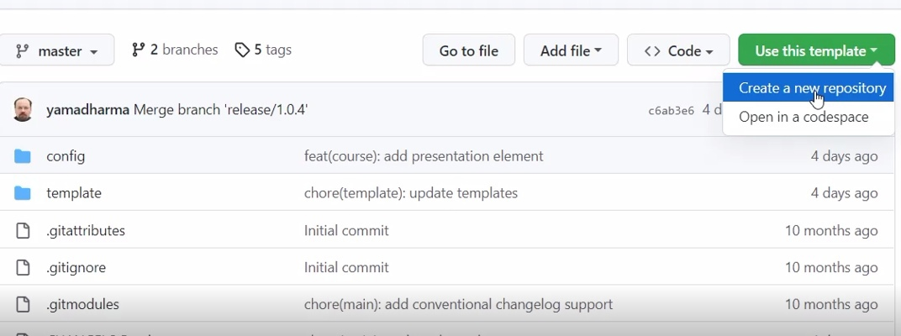
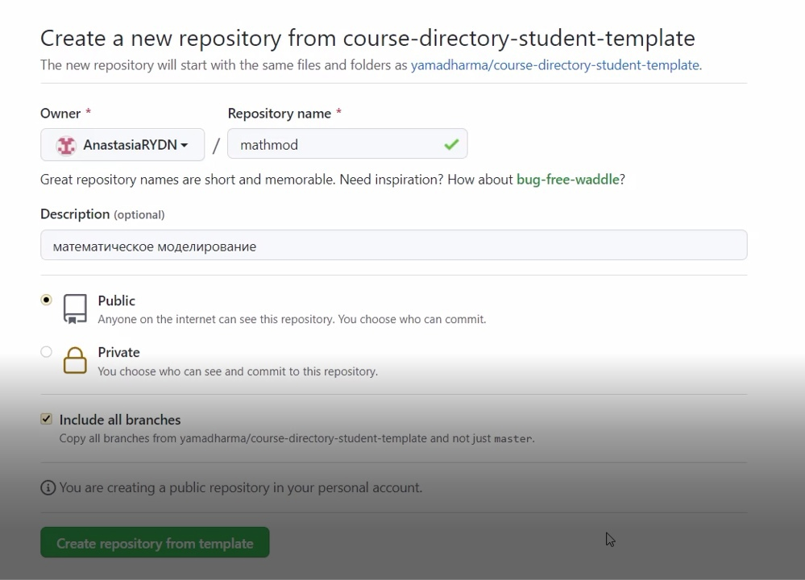
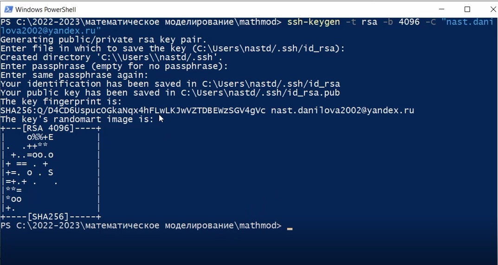
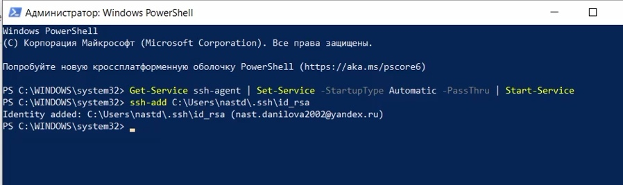
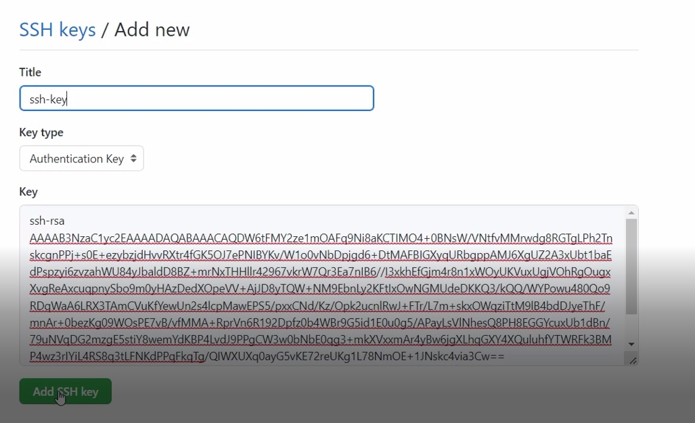
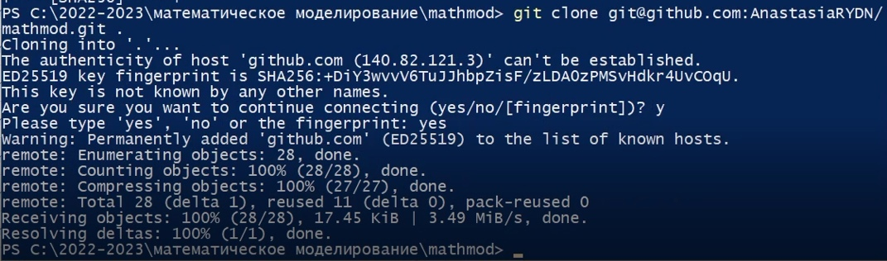
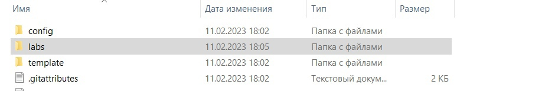
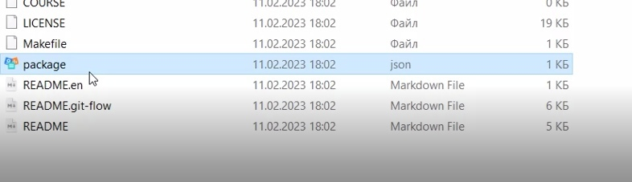
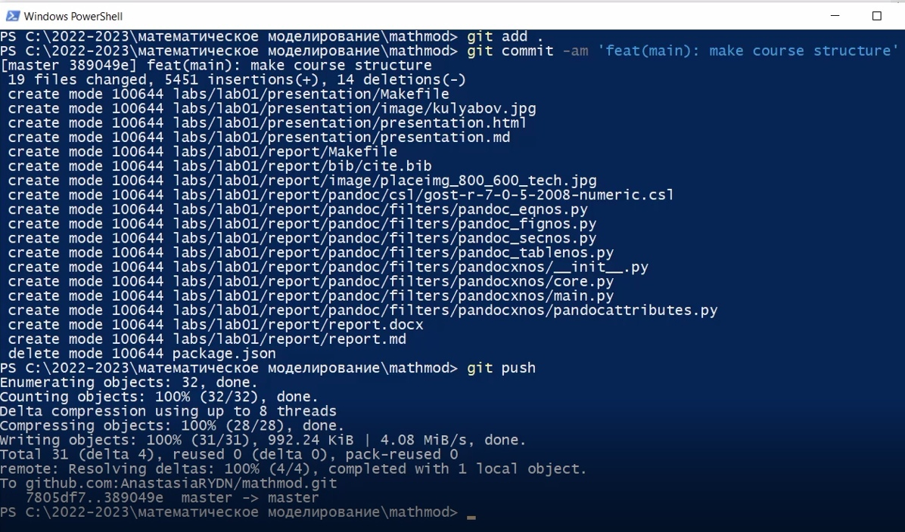

---
## Front matter
title: "Математическое моделирование"
subtitle: "Отчет по лабораторной работе №1"
author: "Данилова Анастасия Сергеевна"

## Generic otions
lang: ru-RU
toc-title: "Содержание"

## Bibliography
bibliography: bib/cite.bib
csl: pandoc/csl/gost-r-7-0-5-2008-numeric.csl

## Pdf output format
toc: true # Table of contents
toc-depth: 2
lof: true # List of figures
lot: true # List of tables
fontsize: 12pt
linestretch: 1.5
papersize: a4
documentclass: scrreprt
## I18n polyglossia
polyglossia-lang:
  name: russian
  options:
	- spelling=modern
	- babelshorthands=true
polyglossia-otherlangs:
  name: english
## I18n babel
babel-lang: russian
babel-otherlangs: english
## Fonts
mainfont: PT Serif
romanfont: PT Serif
sansfont: PT Sans
monofont: PT Mono
mainfontoptions: Ligatures=TeX
romanfontoptions: Ligatures=TeX
sansfontoptions: Ligatures=TeX,Scale=MatchLowercase
monofontoptions: Scale=MatchLowercase,Scale=0.9
## Biblatex
biblatex: true
biblio-style: "gost-numeric"
biblatexoptions:
  - parentracker=true
  - backend=biber
  - hyperref=auto
  - language=auto
  - autolang=other*
  - citestyle=gost-numeric
## Pandoc-crossref LaTeX customization
figureTitle: "Рис."
tableTitle: "Таблица"
listingTitle: "Листинг"
lofTitle: "Список иллюстраций"
lotTitle: "Список таблиц"
lolTitle: "Листинги"
## Misc options
indent: true
header-includes:
  - \usepackage{indentfirst}
  - \usepackage{float} # keep figures where there are in the text
  - \floatplacement{figure}{H} # keep figures where there are in the text
---

# Цель работы

Создание репозитория по шаблону, создание рабочего пространства, учитывая основные правила и создание отчета

# Задание

1. Создаем рабочее пространство, придерживаясь основных правил:
- располагаем в определенной иерархии
- учитываем правила названий папок
2. Создаем репозиторий по данному примеру
3. Создаем отчёт

# Теоретическое введение

**Markdown** - облегчённый язык разметки, созданный с целью обозначения форматирования в простом тексте, с максимальным сохранением его читаемости человеком, и пригодный для машинного преобразования в языки для продвинутых публикаций.

**GitHub** - крупнейший веб-сервис для хостинга IT-проектов и их совместной разработки.
**SSH-Agent и OpenSSH** - это инструменты в Windows, которые можно использовать для аутентификации в удаленных репозиториях Git, таких как GitLab, GitHub, Azure DevOps и т. д. 

# Выполнение лабораторной работы

1. Для начала зайдем в свою учётную запись

2. Затем создадим новый репозиторий по данному нам шаблону

3. После этого, генерируем ssh ключ, для того, чтобы перенести все файлы на компьютер

4. Создаем на GitHub ssh-key

5. С помощью созданного ключа копируем все на компьютер

6. Добавляем несколько новых нужных файлов

7. Далее завершаем настройку каталога курса: удаляем файл package.json

8. Переносим *измененные* файлы обратно на GitHub

9. После всего этого создаем отчет, используя источники с документацией

# Выводы

Мы потренировались работать с консолью, с GitHub и вспомнили, как работать с языком разметки "Markdown"

# Список литературы{.unnumbered}

::: {#refs}
::: 

1. Markdown // Википедия URL: https://ru.wikipedia.org/wiki/Markdown (дата обращения: 11.02.2023).

2. Настройка SSH-агента в Windows для аутентификации Git без пароля // interworks URL: https://interworks.com/blog/2021/09/15/setting-up-ssh-agent-in-windows-for-passwordless-git-authentication/ (дата обращения: 11.02.2023).

3. Создание нового ключа SSH и его добавление в ssh-agent // GitHub URL: https://docs.github.com/ru/authentication/connecting-to-github-with-ssh/generating-a-new-ssh-key-and-adding-it-to-the-ssh-agent (дата обращения: 11.02.2023).
