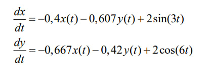
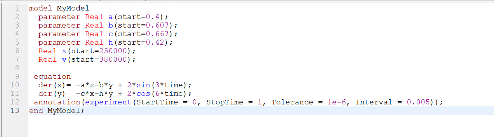
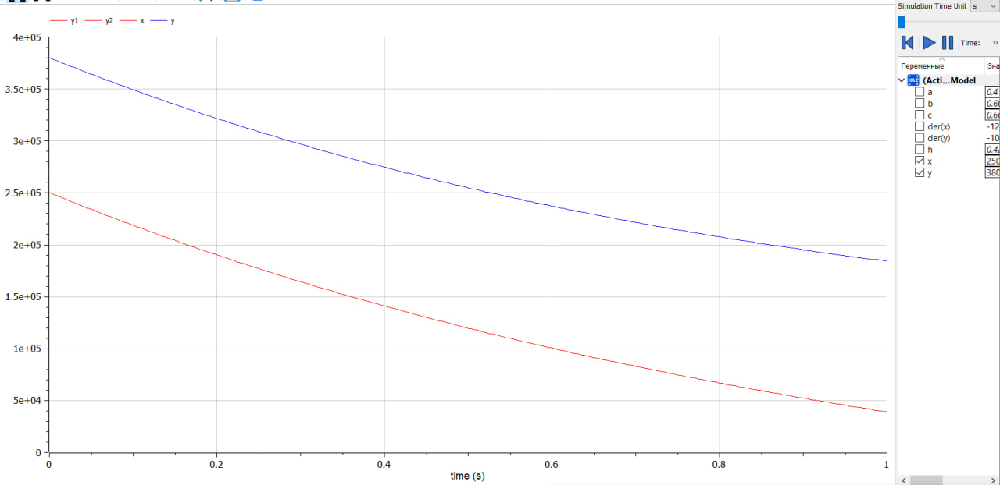
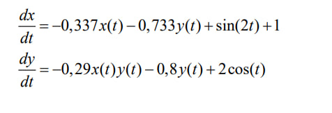
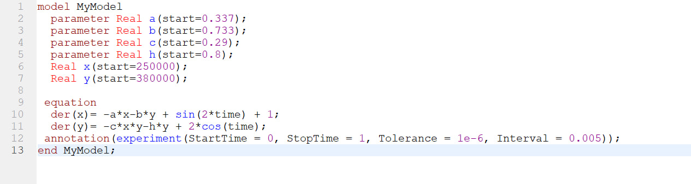
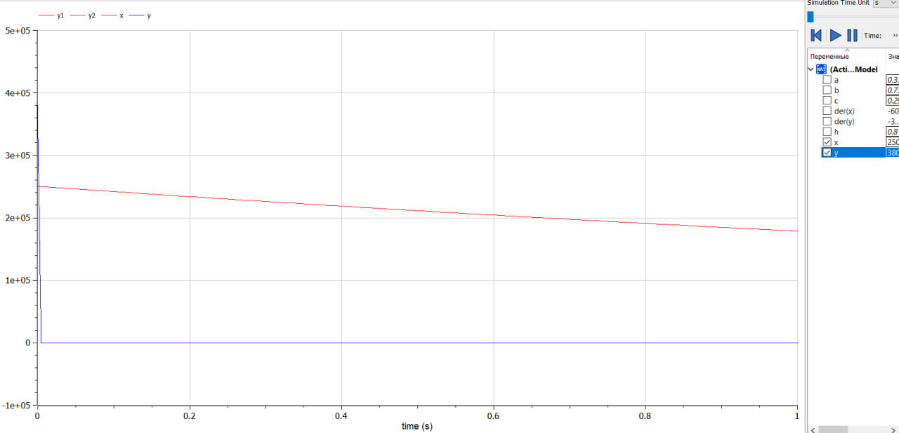

---
## Front matter
lang: ru-RU
title: Математическое моделирование
subtitle: Лабораторная работа №3
author:
- Данилова Анастасия Сергеевна
institute:
  - Российский университет дружбы народов, Москва, Россия
  - Объединённый институт ядерных исследований, Дубна, Россия
date: 01 января 1970

## i18n babel
babel-lang: russian
babel-otherlangs: english

## Formatting pdf
toc: false
toc-title: Содержание
slide_level: 2
aspectratio: 169
section-titles: true
theme: metropolis
header-includes:
 - \metroset{progressbar=frametitle,sectionpage=progressbar,numbering=fraction}
 - '\makeatletter'
 - '\beamer@ignorenonframefalse'
 - '\makeatother'
---

# Информация

## Докладчик

:::::::::::::: {.columns align=center}
::: {.column width="70%"}

  * Данилова Анастасия Сергеевна
  * студент группы НПИбд-01-20
  * с/б 1032201744
  * Российский университет дружбы народов
:::
::: {.column width="30%"}

:::
::::::::::::::

# Вводная часть

## Цели и задачи

- Решить задачу, в которой используются модели боевых действий
- Использовать корректно Julia и OpenModelica

## Материалы и методы

- Справочники и предложенная теория о модели боевых действий
- Julia
- OpenModelica

## Теоретическая часть

Потери, не связанные с боевыми действиями, описывают члены -a(t)x(t) и
-h(t)y(t), члены -b(t)y(t) и -c(t)x(t) отражают потери на поле боя.
Коэффициенты b(t) и c(t) указывают на эффективность боевых действий со
стороны у и х соответственно, a(t),h(t)- величины, характеризующие степень
влияния различных факторов на потери. Функции P(t), Q(t) учитывают
возможность подхода подкрепления к войскам Х и У в течение одного дня

## Условие 

Между страной Х и страной У идет война. Численность состава войск
исчисляется от начала войны, и являются временными функциями
x(t) и y(t). В начальный момент времени страна Х имеет армию численностью 250 000 человек, а в распоряжении страны У армия численностью в 380 000 человек. Для упрощения модели считаем, что коэффициенты
a b c h  постоянны. Также считаем, что P(t) и Q(t) непрерывные функции.
Постройте графики изменения численности войск армии Х и армии У для
двух случаев.

# Выполнение работы

## Первый случай

## Код

## Результат

## Второй случай

## Код

## Результаты

# Выводы

## Результат работы

- мы решили задачу, опираясь на Законы Осипова - Ланчестера
- Ознакомились с таким языком, как Modelica
- Вспомнили Julia

