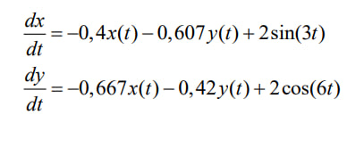
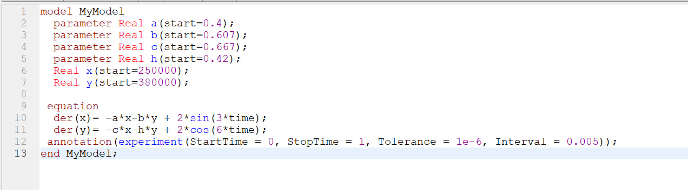
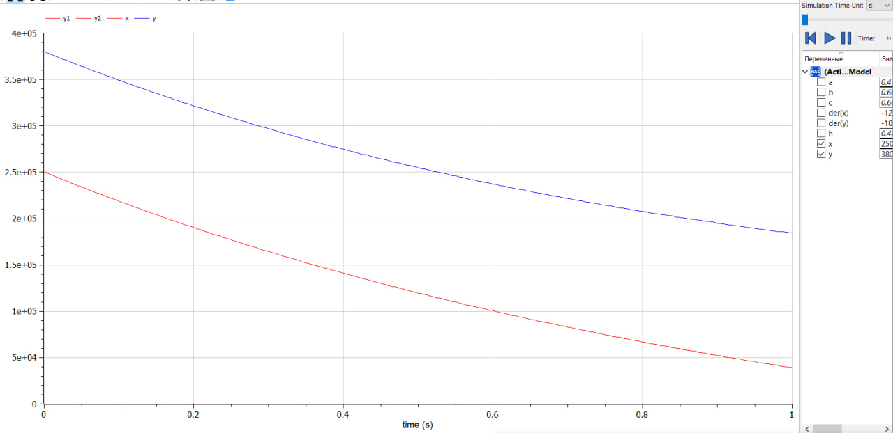
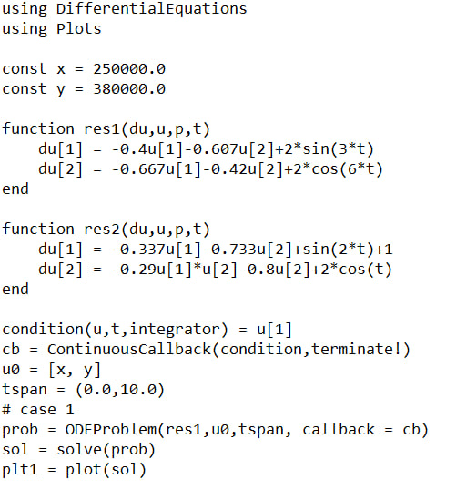
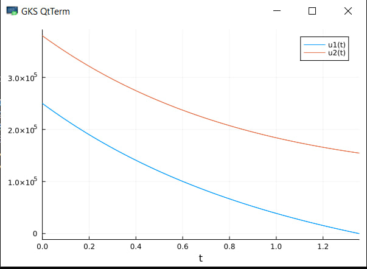
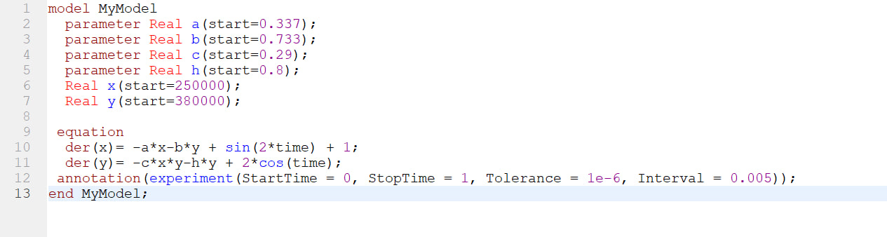
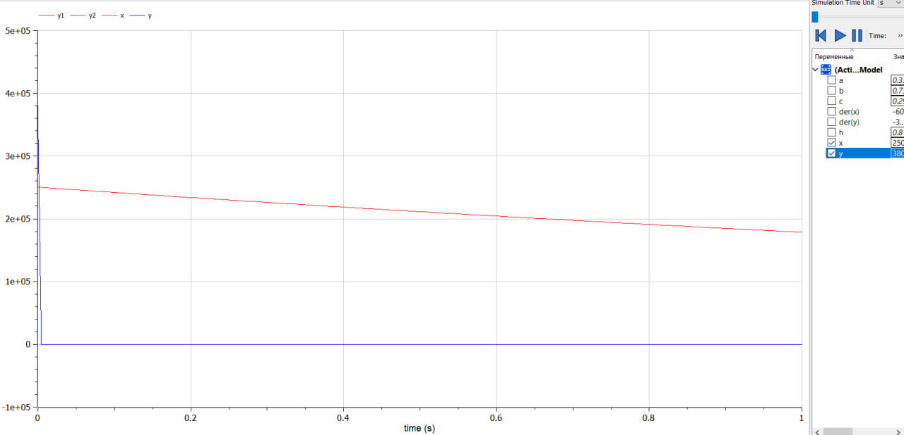
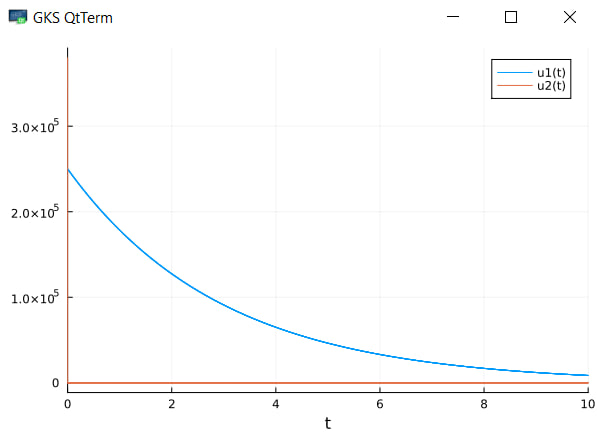

---
## Front matter
title: "Математическое моделирование"
subtitle: "Лабораторная работа №2"
author: "Данилова Анастасия Сергеевна"

## Generic otions
lang: ru-RU
toc-title: "Содержание"

## Bibliography
bibliography: bib/cite.bib
csl: pandoc/csl/gost-r-7-0-5-2008-numeric.csl

## Pdf output format
toc: true # Table of contents
toc-depth: 2
lof: true # List of figures
lot: true # List of tables
fontsize: 12pt
linestretch: 1.5
papersize: a4
documentclass: scrreprt
## I18n polyglossia
polyglossia-lang:
  name: russian
  options:
	- spelling=modern
	- babelshorthands=true
polyglossia-otherlangs:
  name: english
## I18n babel
babel-lang: russian
babel-otherlangs: english
## Fonts
mainfont: PT Serif
romanfont: PT Serif
sansfont: PT Sans
monofont: PT Mono
mainfontoptions: Ligatures=TeX
romanfontoptions: Ligatures=TeX
sansfontoptions: Ligatures=TeX,Scale=MatchLowercase
monofontoptions: Scale=MatchLowercase,Scale=0.9
## Biblatex
biblatex: true
biblio-style: "gost-numeric"
biblatexoptions:
  - parentracker=true
  - backend=biber
  - hyperref=auto
  - language=auto
  - autolang=other*
  - citestyle=gost-numeric
## Pandoc-crossref LaTeX customization
figureTitle: "Рис."
tableTitle: "Таблица"
listingTitle: "Листинг"
lofTitle: "Список иллюстраций"
lotTitle: "Список таблиц"
lolTitle: "Листинги"
## Misc options
indent: true
header-includes:
  - \usepackage{indentfirst}
  - \usepackage{float} # keep figures where there are in the text
  - \floatplacement{figure}{H} # keep figures where there are in the text
---

# Цель работы

Потренироваться решать задачу с использованием языков: Julia и Modelica

# Задание

Между страной Х и страной У идет война. Численность состава войск
исчисляется от начала войны, и являются временными функциями
x(t) и y(t). В начальный момент времени страна Х имеет армию численностью 250 000 человек, а в распоряжении страны У армия численностью в 380 000 человек. Для упрощения модели считаем, что коэффициенты
a b c h  постоянны. Также считаем
P(t) и Q(t) непрерывные функции.
Постройте графики изменения численности войск армии Х и армии У для
двух случаев.

# Теоретическое введение

**Modelica** - свободно распространяемый, объектно-ориентированный язык для моделирования больших, сложных и гетерогенных систем. Он подходит для мульти-домененного моделирования, например, мехатронных моделей в робототехнике, автомобильной и аэрокосмической промышленности.

Возможно, с точки зрения математики наиболее простая для рассмотрения является модель Ланчестера (1995). Его оригинальная модель войны была далее разработана Брауном (1986), Онодой (1999) и Эпштейном (1985). *Модель Ланчестера* или модель боевых действий (имеются только коэффициенты b и f). В этом случае количество жертв пропорционально количеству встреч между индивидуумами противоборствующих сторон (произведение численности сторон: x × y). Наиболее актуально подобное взаимодействие тогда, когда две стороны располагаются на общей территории.

# Выполнение лабораторной работы

Потери, не связанные с боевыми действиями, описывают члены -a(t)x(t) и
-h(t)y(t), члены -b(t)y(t) и -c(t)x(t) отражают потери на поле боя.

Коэффициенты b(t) и c(t) указывают на эффективность боевых действий со
стороны у и х соответственно, a(t),h(t)- величины, характеризующие степень
влияния различных факторов на потери. Функции P(t), Q(t) учитывают
возможность подхода подкрепления к войскам Х и У в течение одного дня

1. Модель боевых действий между регулярными войсками

 Изначально у войск *y* было преимущество в численности. По графику видно, что страна *x* терпит поражение. 

 

2. Боевые действия с участием регулярных войск и партизанских
отрядов 

Мы можем видеть, что число партизан практически сразу стремительно упало, несмотря на их количество. Регулярные войска имеют значительное превосходство. Нам было дано: чтобы одержать победу партизанам необходимо увеличить коэффициент c и повысить свою начальную численность на соответствующую величину. Причем это увеличение, с ростом начальной численности регулярных войск (x(0)) , должно расти не линейно, а пропорционально второй степени x(0).

# Выводы

Мы решили задачу, опираясь на Законы Осипова - Ланчестера, а также ознакомились с таким языком, как Modelica и вспомнили Julia.

# Список литературы

1. The OpenModelica Integrated Environment for Modeling, Simulation, and Model-Based Development // URL: https://www.mic-journal.no/PDF/2020/MIC-2020-4-1.pdf (дата обращения: 25.02.2023).
2. Аналитическая часть // StudFiles URL: https://studfile.net/preview/1515253/page:2/ (дата обращения: 25.02.2023).
3. Определение жертв войн через ланчестерские модели // Соционауки URL: https://www.socionauki.ru/journal/articles/130365/ (дата обращения: 25.02.2023).

