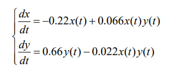

---
## Front matter
lang: ru-RU
title: Математическое моделирование
subtitle: Лабораторная работа №5
author:
  - Данилова Анастасия Сергеевна

## i18n babel
babel-lang: russian
babel-otherlangs: english

## Formatting pdf
toc: false
toc-title: Содержание
slide_level: 2
aspectratio: 69
section-titles: true
theme: metropolis
header-includes:
 - \metroset{progressbar=frametitle,sectionpage=progressbar,numbering=fraction}
 - '\makeatletter'
 - '\beamer@ignorenonframefalse'
 - '\makeatother'
---

# Информация

## Докладчик

  * Данилова Анастасия Сергеевна
  * студентка третьего курса, группы НПИбд-01-20
  * с/б 1032201744
  * Российский университет дружбы народов

# Вводная часть

## Цели и задачи

Решить задачу с моделью взаимодействия двух видов типа «хищник — жертва», используя Julia и OpenModelica.

## Задание

Постройте график зависимости численности хищников от численности жертв,
а также графики изменения численности хищников и численности жертв при
следующих начальных условиях: $x_{0}=7,\ y_{0}=15$. Найдите стационарное
состояние системы.

## Теоретическое введение

**Модель хищник-жертва** 

## Теоретическое введение

В этой модели x – число жертв, y - число хищников. Коэффициент a
описывает скорость естественного прироста числа жертв в отсутствие хищников, с - естественное вымирание хищников, лишенных пищи в виде жертв. 
Если говорить кратко: a, d - коэффициенты смертности
b,c - коэффициенты прироста популяции

## Теоретическое введение

**Стационарное состояние системы**

Это такое состояние системы или процесса, в котором динамика переменных, описывающих поведение системы или процесса и называемых переменными состояниями, не меняется во времени.

# Выполнение работы

## Изменение численности 

## Изменение численности 

## График зависимости

## Стационарное состояние системы

## Изменение численности на Julia

## Изменение численности

## Стационарное состояние

# Результаты

## Вывод

Мы построили график зависимости численности хищников от численности жертв,
график изменения численности хищников и численности жертв, нашли стационарное состояние системы, используя при этом Julia и OpenModelica.
