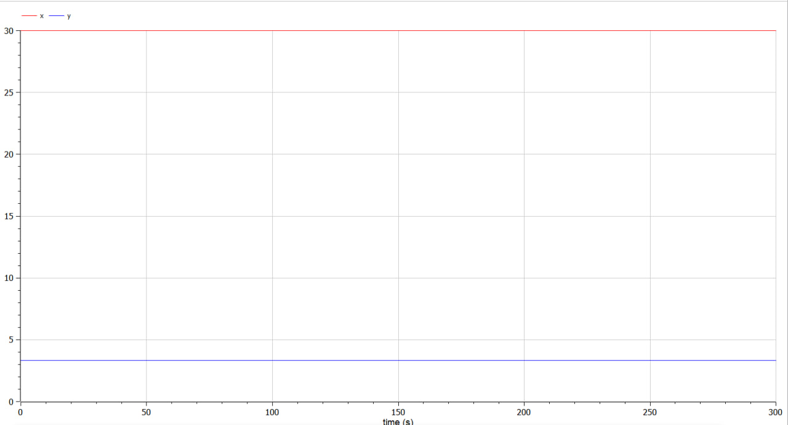

---
## Front matter
title: "Лабораторная работа №5"
subtitle: "Математическое моделирование"
author: "Данилова Анастасия Сергеевна"

## Generic otions
lang: ru-RU
toc-title: "Содержание"

## Bibliography
bibliography: bib/cite.bib
csl: pandoc/csl/gost-r-7-0-5-2008-numeric.csl

## Pdf output format
toc: true # Table of contents
toc-depth: 2
lof: true # List of figures
lot: true # List of tables
fontsize: 12pt
linestretch: 1.5
papersize: a4
documentclass: scrreprt
## I18n polyglossia
polyglossia-lang:
  name: russian
  options:
	- spelling=modern
	- babelshorthands=true
polyglossia-otherlangs:
  name: english
## I18n babel
babel-lang: russian
babel-otherlangs: english
## Fonts
mainfont: PT Serif
romanfont: PT Serif
sansfont: PT Sans
monofont: PT Mono
mainfontoptions: Ligatures=TeX
romanfontoptions: Ligatures=TeX
sansfontoptions: Ligatures=TeX,Scale=MatchLowercase
monofontoptions: Scale=MatchLowercase,Scale=0.9
## Biblatex
biblatex: true
biblio-style: "gost-numeric"
biblatexoptions:
  - parentracker=true
  - backend=biber
  - hyperref=auto
  - language=auto
  - autolang=other*
  - citestyle=gost-numeric
## Pandoc-crossref LaTeX customization
figureTitle: "Рис."
tableTitle: "Таблица"
listingTitle: "Листинг"
lofTitle: "Список иллюстраций"
lotTitle: "Список таблиц"
lolTitle: "Листинги"
## Misc options
indent: true
header-includes:
  - \usepackage{indentfirst}
  - \usepackage{float} # keep figures where there are in the text
  - \floatplacement{figure}{H} # keep figures where there are in the text
---

# Цель работы

Решить задачу с моделью взаимодействия двух видов типа «хищник — жертва», используя Julia и OpenModelica.

# Задание

Вариант 15

Для модели «хищник-жертва»:
 $$\begin{cases}\frac{dx}{dt}= -0.22x(t)+0.066x(t)y(t)\\\frac{dy}{dt}= 0.66y(t)-0.022x(t)y(t)\end{cases}$$

Постройте график зависимости численности хищников от численности жертв,
а также графики изменения численности хищников и численности жертв при
следующих начальных условиях: $x_{0}=7,\ y_{0}=15$. Найдите стационарное
состояние системы.

# Теоретическое введение
Моде́ль Ло́тки — Вольте́рры — модель, названная в честь её авторов, которые предложили модельные уравнения независимо друг от друга. Такие уравнения можно использовать для моделирования систем «хищник - жертва», «паразит - хозяин», конкуренции и других видов взаимодействия между двумя видами. 
 Данная двувидовая модель основывается на следующих предположениях:
1. Численность популяции жертв x и хищников y зависят только от времени
(модель не учитывает пространственное распределение популяции на
занимаемой территории)
2. В отсутствии взаимодействия численность видов изменяется по модели
Мальтуса, при этом число жертв увеличивается, а число хищников падает
3. Естественная смертность жертвы и естественная рождаемость хищника
считаются несущественными
4. Эффект насыщения численности обеих популяций не учитывается
5. Скорость роста численности жертв уменьшается пропорционально
численности хищников

$$\begin{cases}\frac{dx}{dt}= -ax(t)+bx(t)y(t)\\\frac{dy}{dt}= cy(t)-dx(t)y(t)\end{cases}$$

В этой модели x – число жертв, y - число хищников. Коэффициент a
описывает скорость естественного прироста числа жертв в отсутствие хищников, с - естественное вымирание хищников, лишенных пищи в виде жертв. Вероятность взаимодействия жертвы и хищника считается пропорциональной как количеству жертв, так и числу самих хищников (xy). Каждый акт взаимодействия уменьшает популяцию жертв, но способствует увеличению популяции хищников (члены -bxy и dxy в правой части уравнения). 

Стационарное состояние системы (положение равновесия, не зависящее
от времени решение) будет в точке: $$x_{0}=\frac{c}{d},\ y_{0}=\frac{a}{b}$$

Если начальные значения задать в стационарном состоянии $x(0)=x_{0}, \ y(0)=y_{0}$, то в любой момент времени
численность популяций изменяться не будет. При малом отклонении от положения
равновесия численности как хищника, так и жертвы с течением времени не
возвращаются к равновесным значениям, а совершают периодические колебания
вокруг стационарной точки. 

# Выполнение лабораторной работы

Для начала рассмотрим изменения численности хищников и жертв.

Мы можем видеть, что на протяжении всех колебаний число жертв, то есть x, значительно превышает число хищников

Рассмотрим также зависимость численности хищников от численности жертв

Теперь найдем стационарное состояние системы. 

Далее рассмотрим то же самое на Julia

# Выводы

Мы построили график зависимости численности хищников от численности жертв,
график изменения численности хищников и численности жертв, нашли стационарное состояние системы, используя при этом Julia и OpenModelica.

# Список литературы

1. Модель хищник-жертва // URL: https://esystem.rudn.ru/pluginfile.php/1971733/mod_resource/content/2/Лабораторная%20работа%20№%204.pdf (дата обращения: 11.03.2023).
2. Модель Лотки-Вольтерры // URL: https://math-it.petrsu.ru/users/semenova/MathECO/Lections/Lotka_Volterra.pdf (дата обращения: 11.03.2023).
3. Сауленко, Е. П. Анализ системы уравнений «хищник — жертва» и доказательство первого и второго законов Вольтерры // Молодой ученый. — 2020. — № 2 (292). — С. 1-5. — URL: https://moluch.ru/archive/292/66101/ (дата обращения: 11.03.2023).

