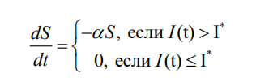
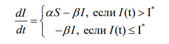
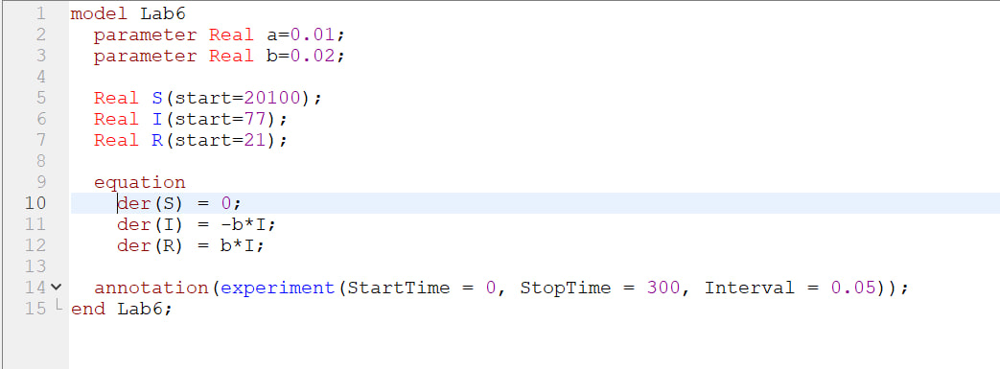
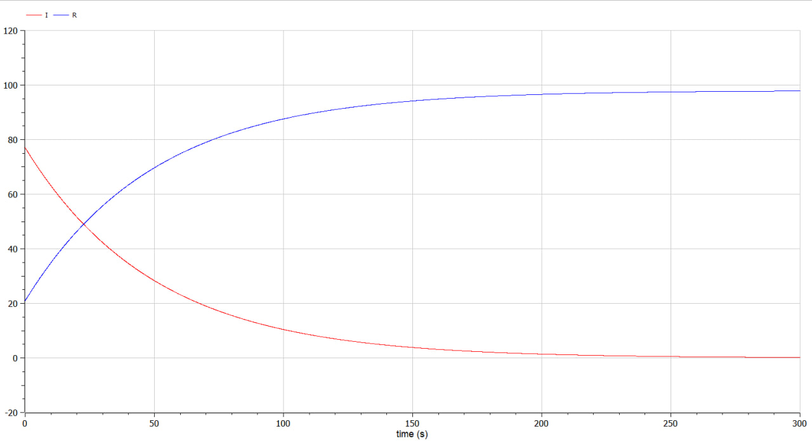
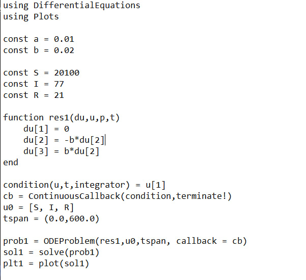
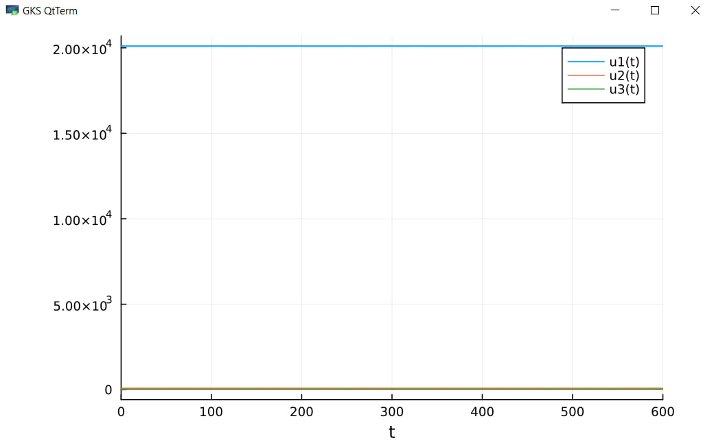
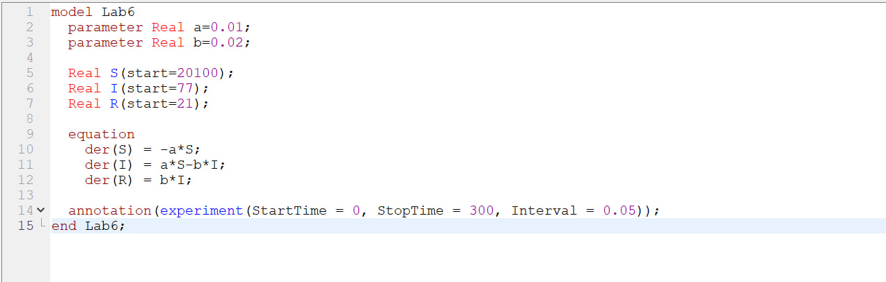
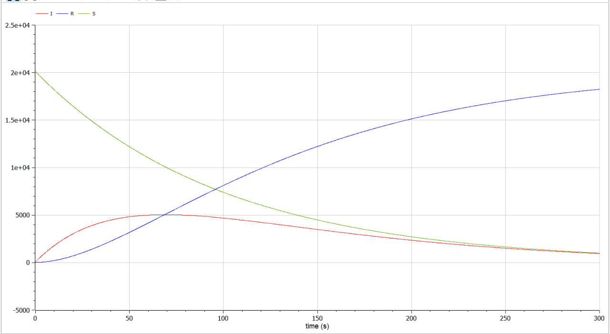

---
## Front matter
lang: ru-RU
title: Математическое моделирование
subtitle: Лабораторная работа 6
author:
  - Данилова А.С
institute:
  - Российский университет дружбы народов, Москва, Россия
  - Объединённый институт ядерных исследований, Дубна, Россия
date: 01 января 1970

## i18n babel
babel-lang: russian
babel-otherlangs: english

## Formatting pdf
toc: false
toc-title: Содержание
slide_level: 2
aspectratio: 169
section-titles: true
theme: metropolis
header-includes:
 - \metroset{progressbar=frametitle,sectionpage=progressbar,numbering=fraction}
 - '\makeatletter'
 - '\beamer@ignorenonframefalse'
 - '\makeatother'
---

# Информация

## Докладчик

  * Данилова Анастасия Сергеевна
  * студент группы НПИбд-01-20
  * с/б 1032201744
  * Российский университет дружбы народов

# Вводная часть

## Цели и задачи

Решить задачу об эпидемии с двумя случаями на языках Julia и Modelica.

## Задание

На одном острове вспыхнула эпидемия. Известно, что из всех проживающих
на острове (N=20 100) в момент начала эпидемии (t=0) число заболевших людей
(являющихся распространителями инфекции) I(0)=77, а число здоровых людей с
иммунитетом к болезни R(0)=21. Таким образом, число людей восприимчивых к
болезни, но пока здоровых, в начальный момент времени S(0)=N-I(0)- R(0).

## Задание

Постройте графики изменения числа особей в каждой из трех групп.
Рассмотрите, как будет протекать эпидемия в случае:
1. если $I(0)\leq I^*$
2. если $I(0)>I^*$

## Теоретическое введение

Скорость изменения числа S(t) меняется по следующему закону:

## Теоретическое введение

Cкорость изменения числа
инфекционных особей представляет разность за единицу времени между
заразившимися и теми, кто уже болеет и лечится, т.е

 

## Теоретическое введение

А скорость изменения выздоравливающих особей (при этом приобретающие
иммунитет к болезни)

Постоянные пропорциональности $\alpha, \beta$, - это коэффициенты заболеваемости
и выздоровления соответственно.

# Выполнение работы

## Первое условие

## Исход эпидемии

## Первое условие

## Исход

## Второе условие

## Исход эпидемии

# Результаты

## Вывод

Мы решили задачу об эпидемии, в которой рассмотрели два случая с разными исходами. В процессе решения мы использовали языки Julia и Modelica.
