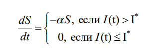
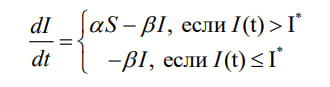
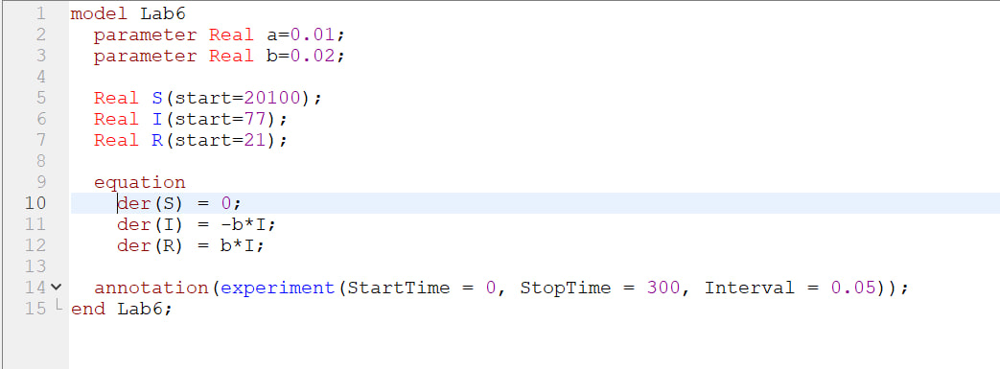
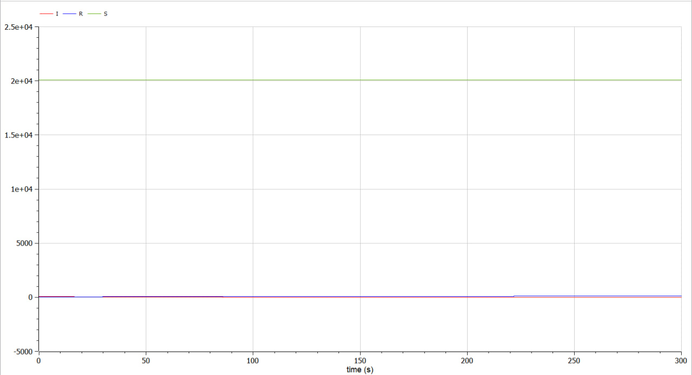
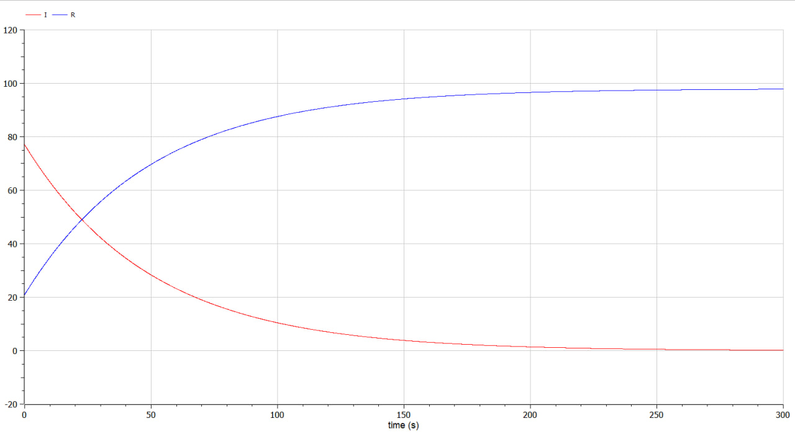
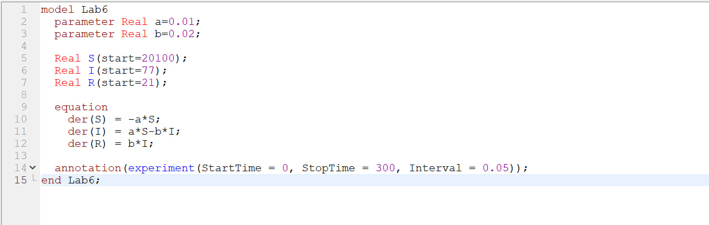
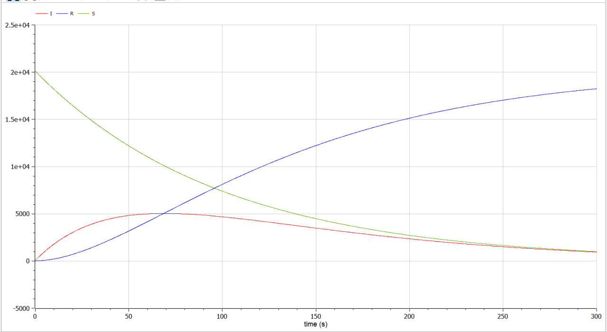
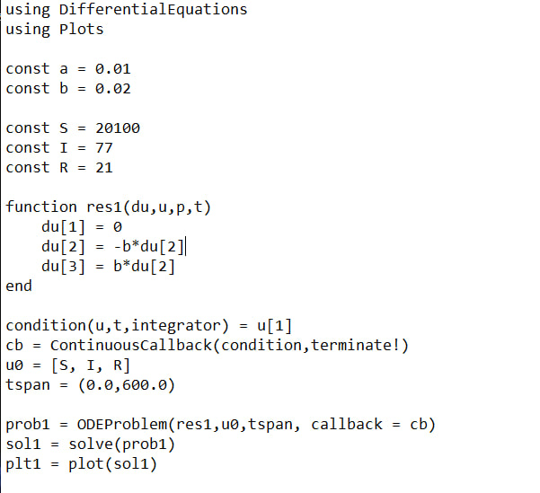
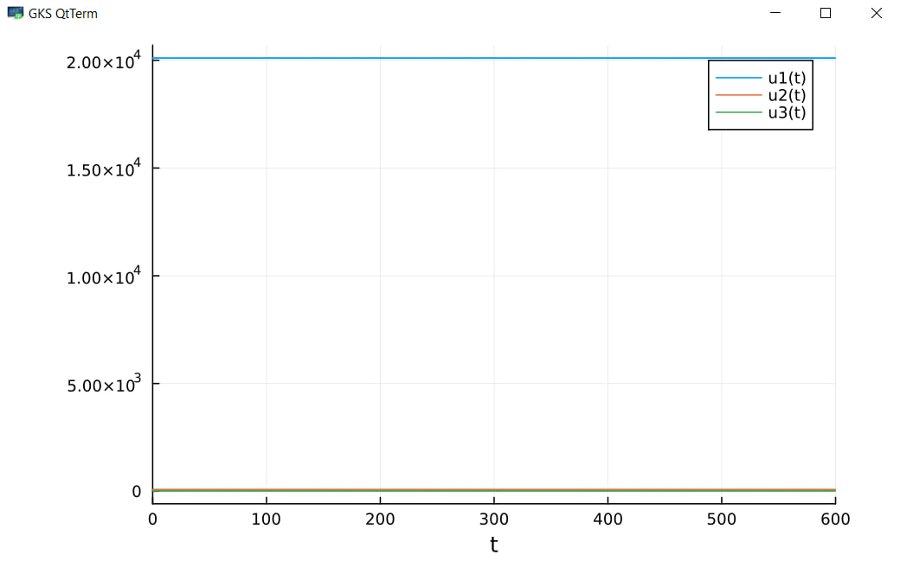

---
## Front matter
title: "Лабораторная работа №6"
subtitle: "Математическое моделирование"
author: "Данилова Анастасия Сергеевна"

## Generic otions
lang: ru-RU
toc-title: "Содержание"

## Bibliography
bibliography: bib/cite.bib
csl: pandoc/csl/gost-r-7-0-5-2008-numeric.csl

## Pdf output format
toc: true # Table of contents
toc-depth: 2
lof: true # List of figures
lot: true # List of tables
fontsize: 12pt
linestretch: 1.5
papersize: a4
documentclass: scrreprt
## I18n polyglossia
polyglossia-lang:
  name: russian
  options:
	- spelling=modern
	- babelshorthands=true
polyglossia-otherlangs:
  name: english
## I18n babel
babel-lang: russian
babel-otherlangs: english
## Fonts
mainfont: PT Serif
romanfont: PT Serif
sansfont: PT Sans
monofont: PT Mono
mainfontoptions: Ligatures=TeX
romanfontoptions: Ligatures=TeX
sansfontoptions: Ligatures=TeX,Scale=MatchLowercase
monofontoptions: Scale=MatchLowercase,Scale=0.9
## Biblatex
biblatex: true
biblio-style: "gost-numeric"
biblatexoptions:
  - parentracker=true
  - backend=biber
  - hyperref=auto
  - language=auto
  - autolang=other*
  - citestyle=gost-numeric
## Pandoc-crossref LaTeX customization
figureTitle: "Рис."
tableTitle: "Таблица"
listingTitle: "Листинг"
lofTitle: "Список иллюстраций"
lotTitle: "Список таблиц"
lolTitle: "Листинги"
## Misc options
indent: true
header-includes:
  - \usepackage{indentfirst}
  - \usepackage{float} # keep figures where there are in the text
  - \floatplacement{figure}{H} # keep figures where there are in the text
---

# Цель работы

Решить задачу об эпидемии с двумя случаями на языках Julia и Modelica.

# Задание

На одном острове вспыхнула эпидемия. Известно, что из всех проживающих
на острове (N=20 100) в момент начала эпидемии (t=0) число заболевших людей
(являющихся распространителями инфекции) I(0)=77, а число здоровых людей с
иммунитетом к болезни R(0)=21. Таким образом, число людей восприимчивых к
болезни, но пока здоровых, в начальный момент времени S(0)=N-I(0)- R(0).

Постройте графики изменения числа особей в каждой из трех групп.
Рассмотрите, как будет протекать эпидемия в случае:
1. если $I(0)\leq I^*$
2. если $I(0)>I^*$

# Теоретическое введение

 До того, как число заболевших не превышает критического значения
$\ I^*$, считаем, что все больные изолированы и не заражают здоровых. Когда
$I(0)>I^*$, тогда инфицирование способны заражать восприимчивых к болезни особей. 

Таким образом, скорость изменения числа S(t) меняется по следующему
закону:

Поскольку каждая восприимчивая к болезни особь, которая, в конце концов,
заболевает, сама становится инфекционной, то скорость изменения числа
инфекционных особей представляет разность за единицу времени между
заразившимися и теми, кто уже болеет и лечится, т.е.:

А скорость изменения выздоравливающих особей (при этом приобретающие
иммунитет к болезни)

# Выполнение лабораторной работы

Рассмотрим первый случай на языке Modelica

Видим, что эпидемия не наступила. Число здоровых людей не уменьшилось, а количество заболевших спало на нет.

Рассмотрим поближе коэфициенты I и R

Теперь посмотрим на второй случай.

Теперь мы видим, что эпидемия взяла верх. Число здоровых людей значительно падает. Однако через какое-то время заболеваемость достигнет пика, и появится больше здоровых людей с иммунитетом.

Посмотрим, как это выглядит на Julia

# Выводы

Мы решили задачу об эпидемии, в которой рассмотрели два случая с разными исходами. В процессе решения мы использовали языки Julia и Modelica.

# Список литературы

1. Задача об эпидемии // URL: https://esystem.rudn.ru/pluginfile.php/1971737/mod_resource/content/2/Лабораторная%20работа%20№%205.pdf (дата обращения: 18.03.2023).
