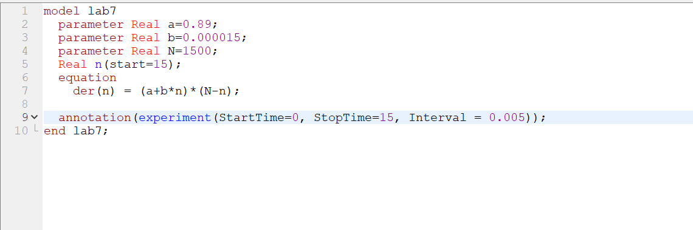
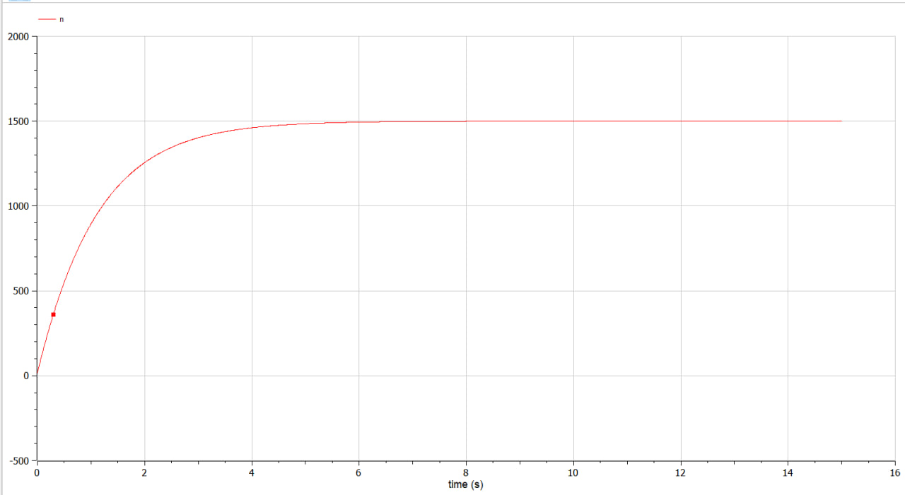
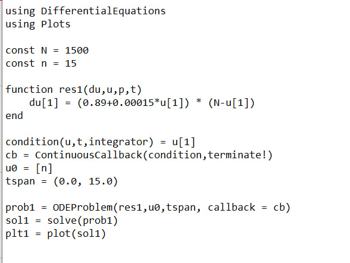
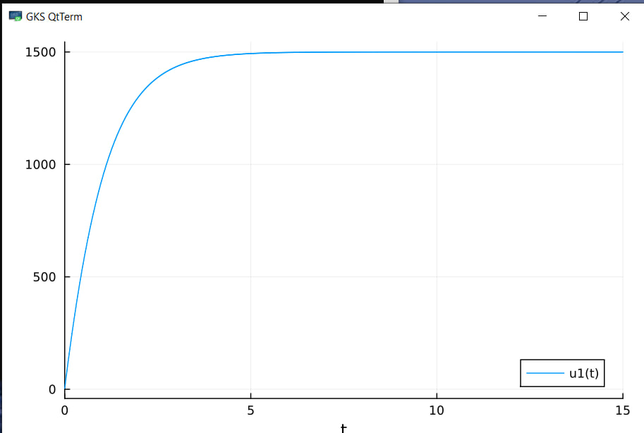
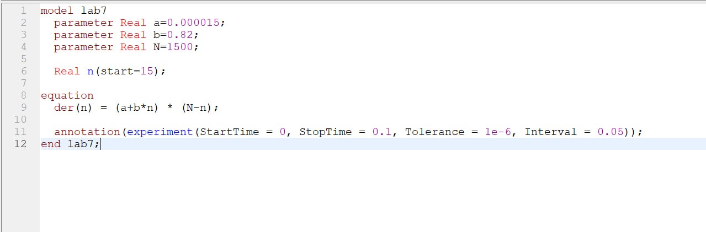
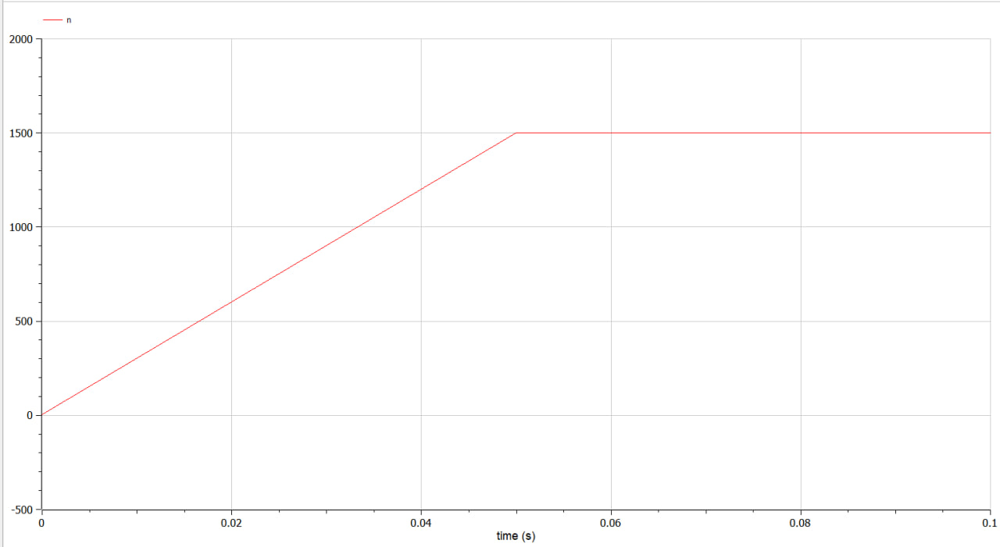
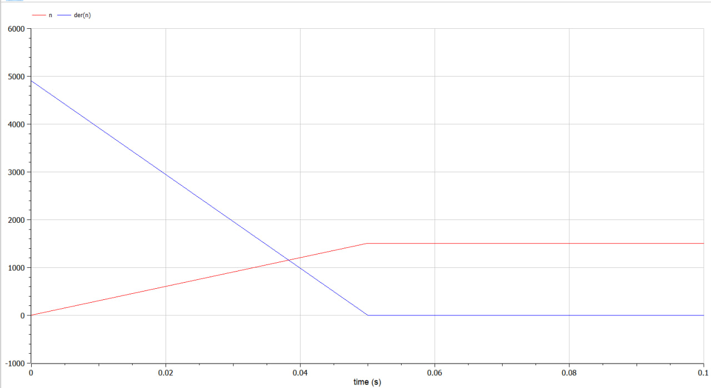
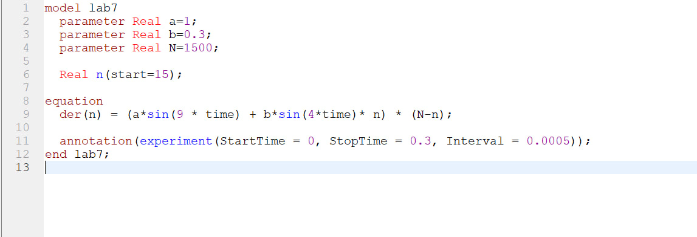
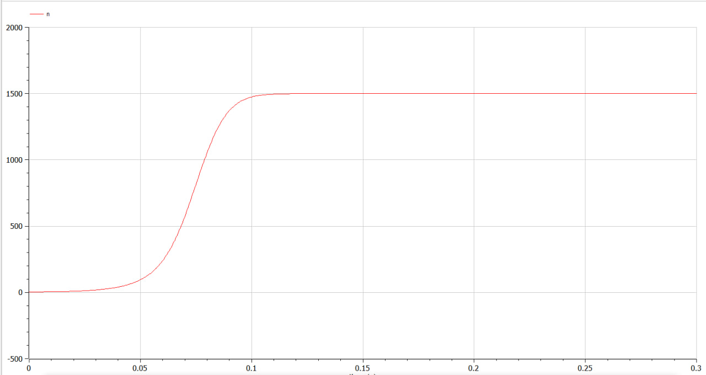

---
## Front matter
lang: ru-RU
title: Математическое моделирование
subtitle: Лабораторная работа 7
author:
  - Данилова А.С.
institute:
  - Российский университет дружбы народов, Москва, Россия
  - Объединённый институт ядерных исследований, Дубна, Россия
date: 01 января 1970

## i18n babel
babel-lang: russian
babel-otherlangs: english

## Formatting pdf
toc: false
toc-title: Содержание
slide_level: 2
aspectratio: 169
section-titles: true
theme: metropolis
header-includes:
 - \metroset{progressbar=frametitle,sectionpage=progressbar,numbering=fraction}
 - '\makeatletter'
 - '\beamer@ignorenonframefalse'
 - '\makeatother'
---

# Информация

## Докладчик

  * Данилова Анастасия Сергеевна
  * студент группы НПИбд-01-20
  * с/б 1032201744
  * Российский университет дружбы народов

# Вводная часть

## Цели и задачи

Решить задачу об эффективности рекламы, используя при этом Julia и OpenModelica. 

## Задание

Постройте график распространения рекламы, математическая модель которой описывается
следующим уравнением:

1. dn/dt=(0.89+0.000015n(t))(N-n(t))

2. dn/dt=(0.000015+0.82n(t))(N-n(t))

3. dn/dt=(sin(9t)+0.3sin(4t)n(t))(N-n(t))

## Задание

При этом объем аудитории
N = 1500, в начальный момент о товаре знает 15 человек. Для
случая 2 определите в какой момент времени скорость распространения рекламы будет
иметь максимальное значение.

## Теоретическое введение

Модель рекламной кампании описывается следующими величинами.
Считаем, что $\frac{dn}{dt}$ - скорость изменения со временем числа потребителей,
узнавших о товаре и готовых его купить,
t - время, прошедшее с начала рекламной
кампании,
n(t) - число уже информированных клиентов.

# Выполнение презентации

## 1 случай

## 1 случай

## 1 случай Julia

## 1 случай Julia

## 2 случай

## 2 случай

## 2 случай

## 3 случай

## 3 случай

# Результаты

## Вывод

Мы решили задачу об эффективности рекламы, рассмотрели 3 разных графика эффективности рекламы, используя при этом Julia и OpenModelica.

